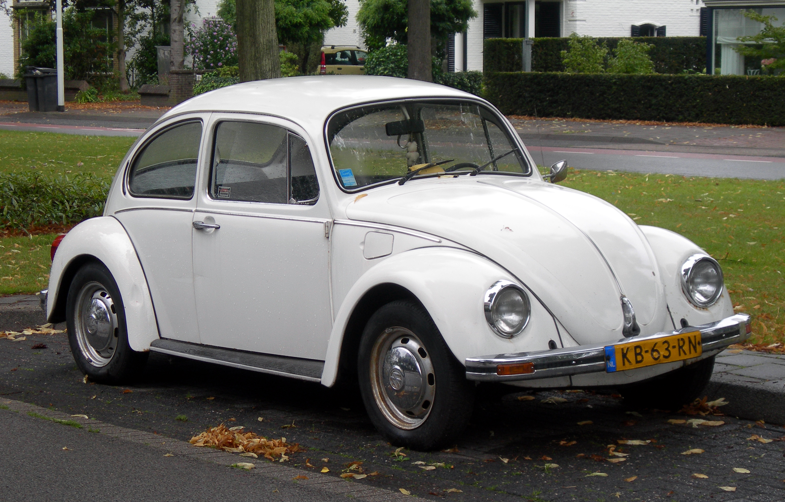
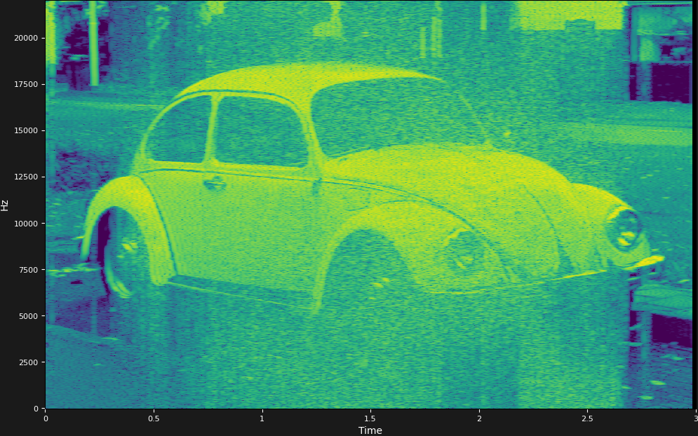

# Spectral-Analyzer
I know some great developers have already built audio spectral viewers, but I wanna build one step by step....

# How to run it

```
python main.py 

```

# Sample

## Original Image


## Source Audio
[Listen Audio](output-test2.wav)

## Spectogram View(Viridis)


The original Beetle photo was converted to audio by mapping pixel brightness to frequencies. Each part of the image produces sound at different frequencies over time. The audio was then analyzed as a spectrogram using the same program, which shows frequency on the vertical axis and time on the horizontal axis. Since the image data was encoded as frequencies, viewing them in a spectrogram shows the Beetle's shape again.(it is not perfect, but it can be seen)


